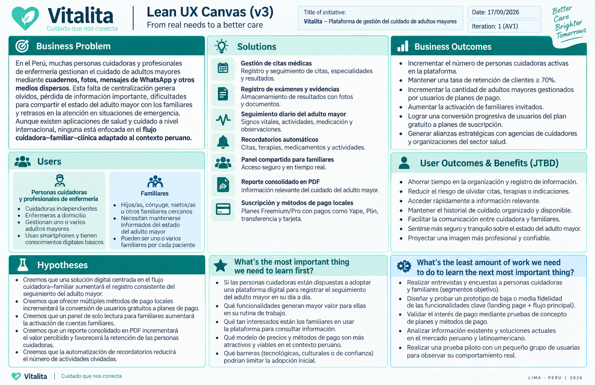
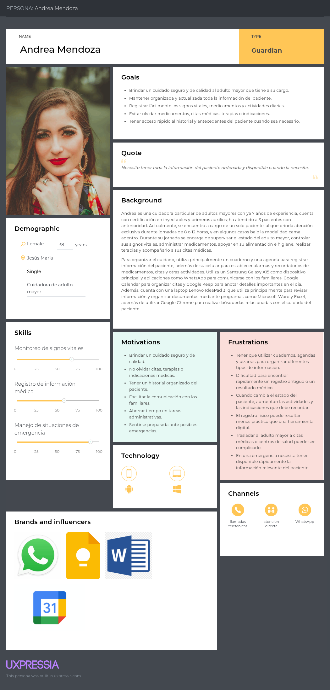

## 1.2.2. Lean UX Process

El Lean UX Process permite formular y validar las principales suposiciones relacionadas con el modelo de negocio, los usuarios, los beneficios esperados y las características propuestas para Vitalita. A partir de estas suposiciones se establecen hipótesis medibles que permitirán contrastar progresivamente si la solución genera valor para los segmentos objetivo.

### 1.2.2.1. Lean UX Problem Statements

**El estado actual** del cuidado diario de adultos mayores en el Perú **se ha enfocado principalmente en** personas cuidadoras y profesionales de enfermería que registran información sobre citas médicas, exámenes, signos vitales, medicamentos y evolución diaria mediante medios dispersos como cuadernos físicos, fotografías, agendas, alarmas del teléfono o conversaciones de WhatsApp. Al mismo tiempo, los familiares dependen frecuentemente de mensajes, llamadas o reportes realizados por la persona cuidadora para conocer el estado reciente del adulto mayor.

**Lo que los productos y servicios existentes no logran resolver** completamente es la centralización del seguimiento cotidiano de un adulto mayor en un espacio digital compartido que permita a la persona cuidadora registrar información de manera estructurada y a los familiares autorizados consultarla oportunamente, reduciendo la dependencia de registros físicos, conversaciones dispersas y archivos difíciles de localizar.

**Nuestro servicio abordará esta brecha** al permitir registrar y organizar el seguimiento diario, las citas médicas, los exámenes y sus evidencias; configurar recordatorios sobre actividades relevantes; compartir información actualizada con familiares autorizados; y generar un reporte consolidado y exportable con información relevante del cuidado del adulto mayor cuando sea necesario.

**Nuestro enfoque inicial será** las personas cuidadoras y profesionales de enfermería independientes que atienden adultos mayores en el Perú, junto con los familiares directamente involucrados en su seguimiento y cuidado.

**Sabremos que tenemos éxito cuando veamos** personas cuidadoras utilizando Vitalita de manera recurrente para registrar información del adulto mayor en lugar de depender exclusivamente de medios dispersos; familiares consultando directamente la plataforma para mantenerse informados; y ambos segmentos utilizando los registros consolidados de Vitalita para encontrar y compartir información relevante del adulto mayor cuando la necesiten.

### 1.2.2.2. Lean UX Assumptions

#### a) Business Assumptions

1. Creemos que existe una necesidad de centralizar digitalmente la información generada durante el cuidado cotidiano de adultos mayores entre personas cuidadoras, profesionales de enfermería y familiares en el Perú.
2. Creemos que un modelo freemium acompañado de planes de suscripción mensual o anual puede ser viable si las funcionalidades de pago proporcionan suficiente valor adicional, como la gestión de múltiples adultos mayores, mayor almacenamiento o funcionalidades avanzadas.
3. Creemos que ofrecer medios de pago familiares para los usuarios peruanos puede disminuir la fricción durante la contratación de los planes de pago y favorecer la conversión a una suscripción.
4. Creemos que Vitalita puede diferenciarse de otras alternativas mediante su especialización en la organización del seguimiento diario y el intercambio de información entre cuidador y familiar dentro del contexto peruano.
5. Creemos que Vitalita puede diferenciarse de las plataformas de intermediación de cuidadores porque su propuesta no consiste principalmente en conectar familias con nuevos cuidadores, sino en proporcionar herramientas de gestión para relaciones de cuidado que ya existen.
6. Creemos que las agencias de cuidadores, organizaciones especializadas en atención de adultos mayores y otras instituciones relacionadas con el cuidado pueden convertirse posteriormente en canales de adquisición y adopción de la plataforma.

#### b) Business Outcome Assumptions

1. Incrementar progresivamente el número de personas cuidadoras activas que utilizan Vitalita de manera recurrente.
2. Incrementar la frecuencia con la que los usuarios registran actividades relacionadas con el seguimiento del adulto mayor.
3. Incrementar la retención de personas cuidadoras mediante funcionalidades utilizadas de manera recurrente durante su jornada de cuidado.
4. Incrementar la cantidad y proporción de familiares invitados que activan sus cuentas y consultan el seguimiento del adulto mayor.
5. Incrementar progresivamente la cantidad de adultos mayores gestionados por usuarios con planes de pago.
6. Incrementar la conversión de usuarios del plan gratuito hacia planes de suscripción.
7. Reducir progresivamente la tasa de cancelación de las suscripciones a medida que los usuarios incorporan Vitalita a su rutina de cuidado.

#### c) User Assumptions

1. Creemos que nuestro segmento principal está compuesto por personas cuidadoras y profesionales de enfermería que atienden adultos mayores en el Perú y que poseen conocimientos básicos para utilizar smartphones y aplicaciones digitales.
2. Creemos que nuestro segundo segmento está compuesto por familiares responsables o involucrados en el cuidado de un adulto mayor que necesitan mantenerse informados incluso cuando no pueden acompañarlo durante toda la jornada.
3. Creemos que un mismo adulto mayor puede requerir que más de un familiar autorizado consulte su seguimiento.
4. Creemos que algunas personas cuidadoras pueden gestionar más de un adulto mayor y necesitar alternar entre sus perfiles dentro de la plataforma.

#### d) User Outcome and Benefit Assumptions

1. Creemos que las personas cuidadoras buscan reducir el tiempo dedicado a organizar y comunicar repetidamente la información relacionada con el cuidado del adulto mayor.
2. Creemos que las personas cuidadoras buscan reducir el riesgo de olvidar citas, terapias, exámenes u otras actividades relevantes del cuidado.
3. Creemos que las personas cuidadoras buscan mantener la información del adulto mayor organizada y disponible cuando la necesiten.
4. Creemos que utilizar registros estructurados puede ayudar a las personas cuidadoras a transmitir una imagen de mayor organización y profesionalismo frente a las familias.
5. Creemos que los familiares buscan mantenerse informados sobre el estado reciente del adulto mayor sin depender constantemente de llamadas o mensajes a la persona cuidadora.
6. Creemos que los familiares buscan acceder rápidamente a información relevante y previamente registrada cuando ocurre una situación inesperada o una emergencia.

#### e) Feature Assumptions

1. Creemos que un módulo de citas médicas permitirá registrar y consultar de forma estructurada la fecha, especialidad, resultado y observaciones asociadas a las citas del adulto mayor.
2. Creemos que un módulo de exámenes y evidencias permitirá mantener organizados los resultados de exámenes y asociar evidencias fotográficas para facilitar su posterior consulta.
3. Creemos que un módulo de seguimiento diario permitirá registrar de forma estructurada información relevante como signos vitales, actividades, estado de ánimo y observaciones de la persona cuidadora.
4. Creemos que un sistema de recordatorios permitirá advertir oportunamente sobre próximas citas, terapias y otras actividades pendientes relacionadas con el cuidado.
5. Creemos que un panel compartido para familiares autorizados permitirá consultar información reciente del adulto mayor sin depender continuamente de mensajes o llamadas.
6. Creemos que un generador de reportes en formato PDF permitirá consolidar información relevante previamente registrada y facilitar su consulta o intercambio cuando sea necesario.
7. Creemos que un módulo de suscripción y pagos permitirá gestionar diferentes planes de Vitalita y facilitar la contratación de funcionalidades adicionales.

### 1.2.2.3. Lean UX Hypothesis Statements

#### H1 - Registro de citas médicas

Creemos que lograremos incrementar el uso recurrente de Vitalita si las personas cuidadoras y profesionales de enfermería logran mantener organizadas y disponibles las citas médicas del adulto mayor mediante un módulo que permita registrar fecha, especialidad, resultados y observaciones.

Sabremos que la hipótesis muestra evidencia favorable cuando al menos el 80% de las citas acompañadas por usuarios activos durante el periodo de validación sean registradas en Vitalita dentro de las 24 horas posteriores a su realización.

#### H2 - Registro de exámenes con evidencia

Creemos que lograremos incrementar la frecuencia de uso y la retención de las personas cuidadoras si estas logran mantener los resultados de exámenes organizados y disponibles para futuras consultas mediante un módulo de exámenes que permita registrar resultados y adjuntar evidencias fotográficas.

Sabremos que la hipótesis muestra evidencia favorable cuando al menos el 70% de los exámenes registrados durante el periodo de validación incluyan información del resultado o una evidencia asociada y puedan ser posteriormente localizados por el usuario desde la plataforma.

#### H3 - Seguimiento diario

Creemos que lograremos incrementar la participación recurrente y la retención de personas cuidadoras activas si estas logran registrar y comunicar de forma organizada la evolución diaria del adulto mayor mediante un módulo de seguimiento diario.

Sabremos que la hipótesis muestra evidencia favorable cuando al menos el 60% de las personas cuidadoras activas registren información de seguimiento del adulto mayor durante cinco de cada siete días en el periodo evaluado.

#### H4 - Recordatorios automáticos

Creemos que lograremos incrementar el uso recurrente de Vitalita y contribuir a la retención de las personas cuidadoras si estas logran organizar y recordar oportunamente actividades pendientes relacionadas con el cuidado mediante un sistema de recordatorios de citas, terapias y otras actividades programadas.

Sabremos que la hipótesis muestra evidencia favorable cuando al menos el 75% de los recordatorios con fecha límite sean consultados o marcados como revisados antes del momento programado durante el periodo de validación.

#### H5 - Panel compartido para familiares

Creemos que lograremos incrementar la activación y el uso recurrente de cuentas familiares si los familiares autorizados logran mantenerse informados sobre el seguimiento reciente del adulto mayor sin depender constantemente de mensajes o llamadas mediante un panel compartido de consulta.

Sabremos que la hipótesis muestra evidencia favorable cuando al menos el 60% de los familiares invitados activen su cuenta y consulten el seguimiento del adulto mayor al menos una vez por semana durante el periodo de validación.

#### H6 - Reporte consolidado en PDF

Creemos que lograremos incrementar el valor percibido y el uso recurrente de Vitalita por parte de personas cuidadoras y familiares si estos logran acceder rápidamente a información previamente registrada sobre el cuidado del adulto mayor cuando necesitan consultarla o compartirla mediante un generador de reportes consolidados en formato PDF.

Sabremos que la hipótesis muestra evidencia favorable cuando al menos el 80% de los participantes de las sesiones de validación puedan generar el reporte y localizar en él la información solicitada durante el escenario de prueba sin recurrir a fuentes externas como chats o cuadernos.

#### H7 - Suscripción y métodos de pago

Creemos que lograremos incrementar la conversión de usuarios del plan gratuito hacia planes de pago si las personas cuidadoras que requieren funcionalidades adicionales logran contratar el plan correspondiente mediante un proceso de pago sencillo y compatible con métodos de pago accesibles para ellas utilizando el módulo de suscripciones de Vitalita.

Sabremos que la hipótesis muestra evidencia favorable cuando los usuarios interesados en adquirir un plan puedan completar correctamente el flujo de suscripción durante las pruebas de validación y se observe posteriormente conversión de usuarios activos del plan gratuito hacia algún plan de pago.

### 1.2.2.4. Lean UX Canvas

# 2.1. Competidores
Para el análisis de la competencia se identificaron tres soluciones vigentes que atienden, de forma parcial, necesidades relacionadas con el cuidado del adulto mayor. Ninguna resuelve de manera integral el flujo entre cuidadora, familiar y clínica que aborda Vitalita, por lo que se consideran competidores indirectos con ofertas parcialmente similares. Los tres fueron seleccionados por representar enfoques distintos del mercado: un servicio de cuidado domiciliario en el Perú, una aplicación de teleasistencia por geolocalización y un dispositivo físico de monitoreo con aplicación asociada.

## 2.1.1. Análisis competitivo
#### Competitive Analysis Landscape
#### ¿Por qué llevar a cabo este análisis?
Identificar qué necesidades del cuidado del adulto mayor ya están cubiertas por soluciones existentes y cuáles permanecen desatendidas, con el fin de delimitar la ventaja competitiva de Vitalita frente a alternativas de teleasistencia, monitoreo y contratación de personal.

<table border="1">
  <tr>
    <td valign="top"></td>
    <td valign="top"></td>
    <td valign="top">Vitalita</td>
    <td valign="top">T-Cuido </td>
    <td valign="top">Safe365 </td>
    <td valign="top">SaveFamily </td>
  </tr>
  <tr>
    <td valign="top" rowspan="2">Perfil</td>
    <td valign="top">Overview</td>
    <td valign="top">Plataforma web que centraliza el historial clínico y el seguimiento diario del adulto mayor, compartido entre la cuidadora que registra y los familiares que consultan.</td>
    <td valign="top">Empresa peruana de cuidado domiciliario del adulto mayor con personal de enfermería propio y planes de suscripción.</td>
    <td valign="top">Aplicación española de teleasistencia gratuita basada en geolocalización e inteligencia artificial, operada desde Barcelona.</td>
    <td valign="top">Empresa española de smartwatches con GPS para menores y adultos mayores, con aplicación propia asociada.</td>
  </tr>
  <tr>
    <td valign="top">Ventaja competitiva ¿Qué valor ofrece a los clientes?</td>
    <td valign="top">Especialización en el flujo cuidadora–familiar–clínica, con generación automática de un informe consolidado del paciente ante emergencias.</td>
    <td valign="top">Asume la relación laboral del personal técnico y de enfermería, liberando a la familia de las obligaciones laborales peruanas.</td>
    <td valign="top">Teleasistencia sin costo, con botón de emergencia que moviliza recursos y alertas automáticas de zona y batería.</td>
    <td valign="top">Autonomía del adulto mayor sin depender de un smartphone: el dispositivo integra llamadas, SOS y monitoreo de salud.</td>
  </tr>
  <tr>
    <td valign="top" rowspan="2">Perfil de Marketing</td>
    <td valign="top">Mercado objetivo</td>
    <td valign="top">Enfermeras y cuidadoras independientes de adultos mayores en el Perú, y sus familiares directos.</td>
    <td valign="top">Familias peruanas que requieren cuidado domiciliario para un adulto mayor.</td>
    <td valign="top">Familias con adultos mayores. Presencia en 193 países y 8 idiomas.</td>
    <td valign="top">Familias con menores o adultos mayores con deterioro cognitivo o sensorial. Más de 200.000 familias usuarias.</td>
  </tr>
  <tr>
    <td valign="top">Estrategias de marketing</td>
    <td valign="top"></td>
    <td valign="top">Comunicación dirigida a familias con adultos mayores, con presencia en redes sociales centrada en la profesionalización del cuidador.</td>
    <td valign="top">Crecimiento por invitación: el usuario agrega contactos y les envía un enlace de descarga por SMS, WhatsApp o correo.</td>
    <td valign="top">Venta por web propia y distribuidores externos, con alianzas con servicios de cuidado como Cuidum.</td>
  </tr>
  <tr>
    <td valign="top" rowspan="3">Perfil de Producto</td>
    <td valign="top">Productos &amp; Servicios</td>
    <td valign="top">Registro de citas y exámenes con evidencia fotográfica, reporte diario, recordatorios automáticos, panel de solo lectura para familiares e informe PDF exportable.</td>
    <td valign="top">Planes con monitoreo 24/7 y consultas de geriatría, psiquiatría, rehabilitación física o apoyo emocional; servicios de cuidado y acompañamiento.</td>
    <td valign="top">Seguimiento GPS en tiempo real, zonas seguras con notificación de entrada y salida, aviso de batería baja, chat, registro de actividad y botón SOS.</td>
    <td valign="top">Smartwatch con GPS, aviso de caída, botón SOS, videollamada, recordatorio de medicamentos y monitoreo de frecuencia cardíaca, presión y oxígeno.</td>
  </tr>
  <tr>
    <td valign="top">Precios &amp; Costos</td>
    <td valign="top">Suscripción mensual o anual con versión freemium.</td>
    <td valign="top">Planes semanales y mensuales de 4 semanas de 8 o 12 horas. No publica montos.</td>
    <td valign="top">Descarga gratuita.</td>
    <td valign="top">Alrededor de €78 a €87 por dispositivo; plan de SIM propia opcional.</td>
  </tr>
  <tr>
    <td valign="top">Canales de distribución (Web y/o Móvil)</td>
    <td valign="top">Landing Page y Web Application.</td>
    <td valign="top">Sitio web.</td>
    <td valign="top">Android e iOS.</td>
    <td valign="top">Web propia, distribuidores externos y app en Google Play.</td>
  </tr>
  <tr>
    <td valign="top" rowspan="4">Análisis SWOT</td>
    <td valign="top">Fortalezas</td>
    <td valign="top">Centraliza el historial clínico y el seguimiento diario en un solo lugar, con informe consolidado para emergencias.</td>
    <td valign="top">Asume la relación laboral del personal de enfermería, eliminando el riesgo legal para la familia.</td>
    <td valign="top">Base de usuarios amplia y sin barrera de entrada, con más de 4 millones de descargas y 250.000 usuarios activos diarios.</td>
    <td valign="top">Producto físico que no depende de que el adulto mayor use un smartphone.</td>
  </tr>
  <tr>
    <td valign="top">Debilidades</td>
    <td valign="top">Producto sin trayectoria ni base de usuarios, que solo ofrece software sin servicios complementarios.</td>
    <td valign="top">No cuenta con un producto digital propio para el registro clínico del paciente.</td>
    <td valign="top">Resuelve la localización y seguridad, pero no el seguimiento clínico ni el registro de citas y exámenes.</td>
    <td valign="top">Los recordatorios de medicación son alarmas en el reloj, no un registro clínico consultable.</td>
  </tr>
  <tr>
    <td valign="top">Oportunidades</td>
    <td valign="top">Ausencia de una solución peruana especializada en el registro clínico del adulto mayor.</td>
    <td valign="top">Puede incorporar una plataforma digital apoyándose en su base actual de clientes.</td>
    <td valign="top">Su escala le permite ampliar funcionalidades hacia el registro de salud.</td>
    <td valign="top">Alianzas con servicios de cuidado domiciliario, como la que ya mantiene con Cuidum.</td>
  </tr>
  <tr>
    <td valign="top">Amenazas</td>
    <td valign="top">Resistencia de las cuidadoras a abandonar un método en papel que ya consideran práctico y confiable.</td>
    <td valign="top">Cuidadoras independientes que contratan directamente con las familias, sin intermediario.</td>
    <td valign="top">Dispositivos como SaveFamily cubren su misma función sin depender del smartphone del adulto mayor.</td>
    <td valign="top">Smartwatches genéricos con funciones similares a menor precio.</td>
  </tr>
</table>

## 2.1.2. Estrategias y tácticas frente a competidores.
A partir del análisis competitivo y de los SWOT elaborados para cada competidor, Mobvite plantea las siguientes estrategias preliminares para posicionar a Vitalita en el mercado.
#### Estrategias para afrontar las fortalezas de la competencia
Frente a la principal fortaleza de T-Cuido, que asume la relación laboral del personal de enfermería y elimina el riesgo legal para la familia, la startup no compite por proveer cuidadoras sino por dar herramientas a la cuidadora que ya está contratada. Esto se traduce en comunicar desde el Landing Page que la plataforma funciona con cualquier cuidadora, sea independiente o provista por una agencia, y en explorar alianzas con agencias de cuidado que puedan ofrecer la herramienta a su propio personal.
En el caso de Safe365, cuya adopción masiva se explica por su gratuidad, la respuesta consiste en reducir la fricción inicial mediante una versión freemium que permita gestionar un adulto mayor sin costo, reservando para la versión de pago la gestión de múltiples pacientes y la generación del informe consolidado.
Ante SaveFamily, que tiene la ventaja de no depender del smartphone del adulto mayor, Vitalita compite en un terreno distinto y enfoca su comunicación en el historial consultable y en el informe para emergencias, funciones que un dispositivo de monitoreo no cubre.
#### Estrategias para aprovechar las debilidades de la competencia
El espacio más relevante es que ninguno de los tres competidores construye un historial clínico consultable del paciente: T-Cuido no cuenta con un producto digital de registro, Safe365 resuelve únicamente localización y los recordatorios de SaveFamily son alarmas en el dispositivo. Por ello la propuesta de valor de Vitalita se construye alrededor del registro de citas, exámenes y evolución diaria, priorizando en el roadmap el informe consolidado exportable, que no tiene equivalente entre las alternativas analizadas.
Un segundo espacio es que ninguna de las tres contempla un rol diferenciado para la cuidadora profesional, ya que todas se dirigen a la familia. Vitalita diseña en cambio su experiencia principal para quien genera la información y no solo para quien la consulta, levantando sus necesidades directamente de enfermeras y cuidadoras durante el proceso de needfinding.
El tercero es de menor alcance pero igualmente aprovechable: T-Cuido no publica sus precios, lo que dificulta la decisión de compra, de modo que publicar los planes de forma abierta en el Landing Page constituye una diferencia frente a un competidor directo en el mercado peruano.
#### Estrategias frente al contexto de oportunidades y amenazas
La principal amenaza identificada no proviene de la competencia sino del propio segmento, ya que las cuidadoras utilizan el Kardex en papel y lo consideran una herramienta práctica y confiable. La estrategia consiste entonces en partir de esa herramienta en lugar de proponer un modelo desconocido, diseñando el módulo de registro sobre la estructura del Kardex y comunicando la propuesta como la digitalización de un método existente.
A ello se suma la adaptación del cobro a los medios de pago habituales en el país, integrando Yape, Plin, transferencia bancaria, pago en efectivo y tarjeta, aspecto que las alternativas internacionales no contemplan. El precio se definirá dentro del rango de disposición de pago que arrojen las entrevistas.
Finalmente, la oportunidad de crecimiento por referido se aprovecha habilitando la invitación de familiares desde la cuenta de la cuidadora, dado que cada cuidadora incorpora a varios familiares y cada familiar constituye a su vez un canal hacia otras cuidadoras. En la misma línea se contempla explorar alianzas con clínicas geriátricas y aseguradoras como canal de adquisición de bajo costo.

# 2.2. Entrevistas

## 2.2.1. Diseño de entrevistas

En esta sección se presenta el diseño de las entrevistas dirigidas a los dos segmentos objetivo definidos en la sección 1.3: enfermeras y cuidadoras de adultos mayores, y familiares directos del adulto mayor. El objetivo es comprender cómo ambos segmentos gestionan actualmente el cuidado y el seguimiento del adulto mayor: cómo registran una cita médica, qué hacen con el resultado de un examen, de qué manera informan a la familia sobre el estado del paciente.

El cuestionario se elaboró partiendo de las características necesarias para construir los arquetipos de cada segmento. En consecuencia, las preguntas recogen tanto características objetivas (edad, género, distrito de residencia, estado civil, composición familiar y ocupación) como características subjetivas y de comportamiento (personalidad, habilidades, marcas e influencias, dispositivos de preferencia, canales digitales de interacción, objetivos, frustraciones y background).

Cada entrevista tiene una duración estimada de 20 a 30 minutos y se registra en vídeo, previa autorización del entrevistado obtenida al inicio de la grabación. Se considera de tres a cinco entrevistas por segmento objetivo. El registro de cada una se presenta en la sección 2.2.2.

---

## Segmento 1°: Enfermeras y Cuidadoras de adultos mayores

### Perfil y background

1. ¿Cuál es tu nombre completo y qué edad tienes?
2. ¿En qué distrito vives y en qué distrito trabajas?
3. Cuéntame tu formación: ¿eres enfermera titulada, técnica, o llegaste al cuidado por otro camino?
4. ¿Hace cuánto te dedicas al cuidado de adultos mayores y cómo empezaste?
5. ¿Con quién vives? ¿Tienes personas a tu cargo en casa?

### Rutina y tareas

6. Descríbeme un día completo de trabajo, desde que llegas hasta que te vas.
7. ¿Cuántos adultos mayores tienes a tu cargo hoy? Si es más de uno, ¿cómo organizas tu tiempo?
8. De todo lo que haces, ¿qué tarea es la más importante y cuál la que más tiempo te quita?
9. ¿Qué pasa cuando acompañas a tu paciente a una cita médica? Cuéntame la última vez.

### Registro de información

10. ¿Cómo llevas el registro de citas, exámenes y medicamentos? Si lo tienes a la mano, muéstramelo.
11. La última vez que te entregaron el resultado de un examen, ¿qué hiciste con ese papel?
12. ¿Te ha pasado que necesitabas un dato del paciente y no lo encontraste? ¿Qué pasó?
13. ¿Cómo haces para acordarte de las citas y de los medicamentos a tiempo?

### Comunicación con la familia

14. ¿Quiénes de la familia te piden información y con qué frecuencia?
15. Cuéntame cómo le informas a la familia al terminar tu turno.
16. ¿Ha habido algún malentendido con la familia por información del paciente? ¿Cómo se resolvió?
17. ¿Cuánto tiempo al día calculas que dedicas a responderle a la familia?

### Emergencias

18. Cuéntame la última emergencia que tuviste con un adulto mayor a tu cargo, paso a paso.
19. Cuando llegaste a la clínica, ¿qué información te pidieron y qué pudiste darles?
20. ¿Qué hubieras necesitado tener en la mano en ese momento?

### Tecnología y canales

21. ¿Qué celular usas, Android o iPhone? ¿Usas también computadora o tablet?
22. ¿Qué aplicaciones abres más en tu día? ¿Cuáles usas para el trabajo?
23. ¿Has usado alguna app de salud o de cuidado de pacientes? ¿Cómo te fue?
24. ¿Dónde te enteras de cosas de tu profesión: grupos de WhatsApp, Facebook, colegas, cursos?

### Objetivos, frustraciones y pago

25. ¿Qué es lo más frustrante de tu trabajo, eso que si pudieras eliminarías mañana?
26. ¿Qué te hace sentir que hiciste un buen trabajo al final del día?
27. ¿Dónde te ves profesionalmente en dos o tres años?
28. ¿Pagas hoy por alguna herramienta o servicio para tu trabajo? ¿Cuánto y por cuál?
29. Si existiera una herramienta que te ahorrara tiempo, ¿cuánto pagarías al mes y con qué método?

### Cierre

30. ¿Hay algo que no te pregunté y que crees que debería saber sobre tu trabajo?
31. ¿Conoces a otra cuidadora, o a algún familiar de un adulto mayor, que pueda conversar conmigo?

---

## Segmento 2°: Familiares del adulto mayor

### Necesidades durante el día

1. ¿Cómo es su participación en el cuidado de su familiar mayor de edad al contar con una enfermera o cuidadora? (Ejemplo: ¿usted ayuda con la movilidad o acompaña a las citas?)
2. ¿Qué aspectos del estado o cuidado del adulto mayor considera más importante conocer durante el día?
3. ¿Con qué frecuencia suele mantenerse informado sobre cómo se encuentra el adulto mayor?

### Seguimiento

4. Cuando ocurre algún cambio o alteración en el estado del adulto mayor, ¿cómo se entera de lo sucedido?

### Citas y exámenes

5. Cuando el adulto mayor asiste a una cita médica o terapia acompañado por la enfermera o cuidadora, ¿qué información espera recibir después de la cita?

### Información por parte de la enfermera

6. ¿Qué información suele proporcionarle la enfermera o cuidadora sobre lo ocurrido con el adulto mayor durante el día?
7. ¿De qué manera recibe actualmente información sobre el estado y evolución de su familiar mayor en el día y dónde queda registrada?
8. ¿Qué medio o tecnología usa para comunicarse con la cuidadora? (Especificar dispositivo móvil y medio).
9. Si la enfermera o cuidadora no se encuentra disponible, ¿qué información necesitaría tener para conocer el estado y los antecedentes recientes del adulto mayor?

### Disponibilidad de información

10. ¿Ha tenido alguna dificultad para acceder a información que necesitaba sobre el cuidado, una cita o un examen del adulto mayor? ¿Qué ocurrió?

### Cierre e invitación

11. ¿Cuál considera que es actualmente la mayor dificultad para mantenerse informado sobre el cuidado y estado del adulto mayor?
12. Si pudiera mejorar una sola cosa de la forma en que actualmente recibe o consulta información sobre el adulto mayor, ¿qué cambiaría?
13. ¿Cómo cree que cambiaría su experiencia si pudiera consultar en un solo lugar el seguimiento, las citas, los exámenes y la información registrada por la enfermera o cuidadora?

# 2.3. Needfinding

### 2.3.1. User Personas

**Primer segmento objetivo:**

**Segundo segmento objetivo:**

### 2.3.2. User Task Matrix

**Primer segmento objetivo:**

**Segundo segmento objetivo:**

### 2.3.3. User Journey Mapping.

### 2.3.4. Empathy Mapping.

### **Primer segmento objetivo:**

# 2.4. Big Picture EventStorming. 

El Big Picture Event Storming de **Vitalita** permite representar de manera visual los principales procesos de negocio identificados durante el análisis del proyecto. Esta técnica se utiliza para comprender el dominio de la solución a partir de los eventos relevantes que ocurren dentro del sistema, priorizando los hechos del negocio por encima de detalles técnicos de implementación.

Vitalita es una aplicación orientada al cuidado y seguimiento de adultos mayores. Su propósito principal es centralizar la información relacionada con citas médicas, exámenes, signos vitales, medicación, terapias, estado diario y observaciones del paciente. De esta manera, la cuidadora o enfermera puede registrar información de forma organizada, mientras que los familiares pueden consultar el estado del adulto mayor sin depender únicamente de llamadas, mensajes de WhatsApp o registros físicos.

En el Event Storming se identificaron como actores principales a la **cuidadora o enfermera**, quien cumple el rol operativo dentro de la plataforma, y al **familiar directo**, quien accede principalmente a la información registrada. También se reconoce la participación externa de **clínicas u hospitales**, ya que el sistema contempla la generación de un informe PDF con el historial del adulto mayor para ser utilizado en situaciones de emergencia médica.

El modelo se organiza en cinco bounded contexts principales. El primero es **Descubrimiento y Acceso**, donde se agrupan los procesos de registro, inicio de sesión y asignación de roles. El segundo es **Gestión de Adultos Mayores**, enfocado en el registro del paciente, la actualización de sus datos básicos y la asignación de familiares con acceso de consulta. El tercero es **Registros de Salud y Seguimiento Diario**, que constituye el núcleo del dominio, ya que concentra los registros de signos vitales, estado de ánimo, medicación, terapias, citas, exámenes y evidencias fotográficas. El cuarto contexto es **Seguimiento Familiar y Emergencias**, donde se modela la consulta del panel familiar, las notificaciones relevantes y la generación del informe PDF. Finalmente, el contexto de **Suscripciones y Pagos** representa el modelo de monetización de la plataforma mediante prueba gratuita, selección de plan, pago y activación de suscripción.

Entre los eventos de dominio más importantes se encuentran: **Adulto mayor registrado**, **Estado diario registrado**, **Signos vitales registrados**, **Medicación registrada**, **Cita médica registrada**, **Examen registrado**, **Evidencia fotográfica adjuntada**, **Familiar notificado**, **Emergencia reportada**, **Informe PDF generado** y **Suscripción activada**. Estos eventos representan hechos significativos dentro del negocio y permiten comprender cómo evoluciona la información del adulto mayor dentro de la plataforma.

Asimismo, se identificaron reglas de negocio relevantes. Por ejemplo, cuando se registra un adulto mayor, el sistema debe permitir asociar familiares responsables con acceso de solo lectura. Cuando se registra una actividad próxima o pendiente, como una cita médica, terapia o examen, el sistema debe generar recordatorios automáticos. Del mismo modo, cuando se detecta una emergencia, se debe generar un informe PDF con el historial completo del paciente. Estas reglas permiten conectar eventos con nuevos comandos y muestran cómo ciertas acciones del usuario pueden activar procesos automáticos del sistema.

Durante el análisis también se detectaron algunos hotspots o puntos de incertidumbre. El primero está relacionado con los permisos exactos de cada rol, ya que el proyecto diferencia entre cuidadoras y familiares, pero no detalla completamente las restricciones específicas de cada usuario. El segundo corresponde al canal de notificaciones, debido a que se mencionan alertas automáticas, pero no se define si serán enviadas por notificación push, correo electrónico, SMS, WhatsApp u otro medio. El tercer hotspot se encuentra en el módulo de pagos, donde se mencionan métodos como Yape, Plin, transferencia, efectivo y tarjeta, pero no se especifica la pasarela o proveedor técnico que se utilizará.

# 2.5. Ubiquitous Language.

El presente glosario reúne los términos del dominio del cuidado del adulto mayor que el equipo utiliza de forma consistente en la documentación, el modelado y la implementación de Vitalita. Los términos provienen del análisis del dominio y de las entrevistas realizadas a enfermeras y cuidadoras, y su definición busca eliminar ambigüedades en la comunicación entre los miembros del equipo y los stakeholders.

#### **1\. Stakeholders & Roles**

* **Caregiver (Cuidadora):** Persona encargada del cuidado diario de un adulto mayor. Es quien registra la información en la plataforma. Puede tener a su cargo más de un adulto mayor de forma simultánea.  
* **Nurse (Enfermera):** Profesional de enfermería, titulada o técnica, que brinda cuidado especializado al adulto mayor y aplica registros formales propios de su profesión.  
* **Older Adult (Adulto mayor):** Persona de 60 años a más que recibe cuidado y cuyo seguimiento se registra en la plataforma.  
* **Family Member (Familiar):** Pariente directo del adulto mayor que accede al seguimiento en modalidad de solo lectura. Un mismo adulto mayor puede tener más de un familiar con acceso.  
* **Primary Family Contact (Familiar responsable):** Familiar con quien se establece el acuerdo de cuidado y que actúa como contacto principal ante emergencias.

#### **2\. Funcionalidades de la Plataforma**

* **Register Older Adult (Registro de adulto mayor):** Proceso mediante el cual la cuidadora incorpora a un adulto mayor a la plataforma con sus datos básicos de cuidado.  
* **Register Medical Appointment (Registro de cita médica):** Proceso mediante el cual se registra una cita con tipo, fecha, resultado y notas de la cuidadora.  
* **Register Medical Exam (Registro de examen):** Proceso mediante el cual se registra un examen indicado al adulto mayor, con la posibilidad de adjuntar evidencia fotográfica del resultado.  
* **Daily Report (Reporte diario):** Registro del estado del adulto mayor durante la jornada, que incluye funciones vitales, observaciones y estado de ánimo.  
* **Family Dashboard (Panel familiar):** Vista de solo lectura mediante la cual el familiar consulta el seguimiento del adulto mayor sin depender de que la cuidadora se lo comunique.  
* **Automatic Reminder (Recordatorio automático):** Aviso generado por la plataforma sobre citas próximas, terapias y resultados de exámenes pendientes.  
* **Emergency Report (Informe de emergencia):** Documento exportable que consolida el historial del adulto mayor para ser presentado ante el personal clínico.  
* **Family Invitation (Invitación de familiar):** Proceso mediante el cual la cuidadora otorga a un familiar acceso de solo lectura al seguimiento de un adulto mayor.  
* **Subscription Plan (Plan de suscripción):** Modalidad de pago recurrente mediante la cual la cuidadora accede a las funcionalidades de la plataforma.

#### **3\. Otros conceptos del dominio**

* **Kardex:** Registro utilizado por el personal de enfermería que organiza por día y horario los medicamentos del paciente, permitiendo marcar cada administración y evitar duplicidades. Incluye también interconsultas y resultados alterados.  
* **Medical History (Historial clínico):** Conjunto acumulado de citas, exámenes, resultados y tratamientos del adulto mayor.  
* **Vital Signs (Funciones vitales):** Indicadores básicos del estado del paciente, entre ellos presión arterial, saturación de oxígeno, frecuencia cardíaca y temperatura.  
* **Blood Pressure (Presión arterial):** Función vital de control prioritario en pacientes geriátricos, dada la prevalencia de hipertensión.  
* **Oxygen Saturation (Saturación):** Nivel de oxígeno en sangre, controlado de forma rutinaria en el seguimiento diario.  
* **Blood Glucose (Glucosa):** Nivel de azúcar en sangre, medido con glucómetro en pacientes diabéticos.  
* **Chronic Disease (Enfermedad crónica):** Condición de larga duración que requiere control permanente, como hipertensión o diabetes.  
* **Medication Schedule (Horario de medicación):** Distribución por día y hora de los medicamentos que el adulto mayor debe tomar.  
* **Interconsultation (Interconsulta):** Derivación del adulto mayor a un especialista distinto de su médico tratante.  
* **Shift Handover (Relevo de turno):** Transferencia de información entre la cuidadora saliente y la entrante sobre el descanso, las funciones vitales y los eventos ocurridos.  
* **Continuous Care (Cuidado continuo):** Modalidad en la que el adulto mayor recibe atención las veinticuatro horas mediante turnos rotativos.  
* **Bedridden Patient (Paciente postrado):** Adulto mayor que no puede movilizarse por sí solo y requiere asistencia total, incluyendo alimentación por sonda en algunos casos.  
* **Postural Change (Cambio postural):** Movilización del paciente encamado, realizada cada dos o tres horas para prevenir lesiones por presión.  
* **Pressure Ulcer (Úlcera por presión, escara):** Lesión de la piel producida por la presión prolongada sobre una zona del cuerpo por falta de movilización.  
* **Body Mechanics (Mecánica corporal):** Técnica de movilización del paciente que evita lesiones tanto en el adulto mayor como en la cuidadora.  
* **Mobility Therapy (Terapia de movilidad):** Ejercicios indicados al adulto mayor para conservar o recuperar su capacidad de movimiento.  
* **Dietary Regimen (Régimen dietético):** Pauta de alimentación indicada al adulto mayor según su condición de salud.  
* **Fall Risk (Riesgo de caída):** Probabilidad elevada de caída en el adulto mayor debido a la pérdida de estabilidad propia de la edad.  
* **Epicrisis (Epicrisis):** Documento clínico que resume el diagnóstico, la evolución y el tratamiento del paciente tras una atención médica.

### **Segundo segmento objetivo:**

